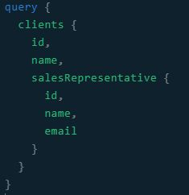

# GraphQL

## Bevezetés

A GraphQL egy nagyon hasznos cucc, melynek segítéségvel a frontend döntheti el, hogy mit szeretne megkapni
a szervertől. Ennek előnye, hogy a hívások számát, és a felesleges adatforgalmat is csökkenteni lehet.

## Felépítése

Alapja a schema, melyet kétféleképpen definiálhatunk: schema-first és code-first megközelítés.
3 különböző műveletet engedélyez:

* query
* mutation
* subscription
	
## Query

A következő képen egy query felépítése látható.

## Referenciák

[Tovább a referenciákra](/misc/references.md)

